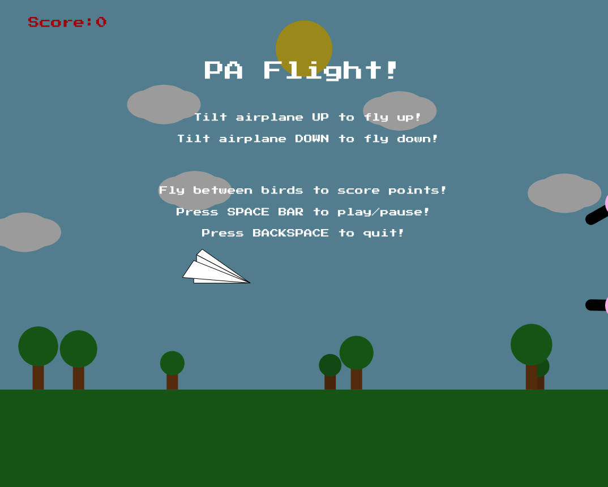

PA Flight!
==========

PA Flight! is an entertaining and challenging paper airplane flying game, created with the p5js library. The main objective of the game is to navigate an airplane between birds to score points. Players can control the plane's altitude by tilting the airplane up and down using the UP and DOWN arrow keys. The game features a landscape background, immersive sound effects, and a dynamic scrolling environment to provide an enjoyable gaming experience.

Table of Contents
-----------------
- [Game Features](#game-features)
- [Requirements](#requirements)
- [Running the Game Locally](#running-the-game-locally)
- [Code Structure](#code-structure)
- [Contributing](#contributing)
- [License](#license)
- [Upcoming Game Enhancements](#upcoming-game-enhancements)

Game Features
-------------
- Smooth airplane control with arrow keys
- Upward and downward tilting for airplane navigation
- Dynamic background scrolling
- Randomly generated bird formations with varying gaps
- Scoring system based on successfully navigating between birds
- Collisions with birds or game boundaries reset the score to zero
- Start, pause, and quit options
- Background music and sound effects for collisions, passing obstacles, and game lost events

Requirements
------------
To run the game locally, you'll need the following software:
- A modern web browser (Google Chrome, Mozilla Firefox, Microsoft Edge, etc.)
- A code editor (Visual Studio Code, Atom, Sublime Text, etc.)
- A local web server (such as Live Server for Visual Studio Code)

Running the Game Locally
------------------------
1. Start by cloning the repository to your local machine:
```
git clone https://github.com/osxzxso/pa-flight.git
```
Alternatively, you can download the repository as a ZIP file and extract it to a desired location.

2. Open the project folder in your code editor.

3. If using Visual Studio Code, install the Live Server extension (if you haven't already), right-click index.html, and select "Open with Live Server".

If using another code editor or web server, follow the respective instructions for launching a local web server.

4. Navigate to the specified URL (usually http://localhost:5500 or http://127.0.0.1:5500) in your web browser to start playing the game.

Code Structure
--------------
The code is organized in the following structure:

- `index.html`: Contains the HTML structure and all the necessary JavaScript and CSS imports.
- `style.css`: Contains the basic styling for the HTML elements.
- `sketch.js`: Contains the primary game logic, event handling, and rendering functions.
- `background.js`: Contains the Background class, which defines the sun, sky, and landscpae objects.
- `cloud.js`: Contains the Cloud class, which defines the cloud objects and handles their placements.
- `tree.js`: Contains the Tree class, which defines the tree objects and handles their placements.
- `bird.js`: Contains the Bird class, which defines the bird objects and handles their placements and collisions.
- `airplane.js`: Contains the Airplane class, which defines the airplane object and handles its movement.

All the assets (sounds and fonts) are stored in the `assets` folder, while the p5js library files are stored in the `libraries` folder.

Contributing
------------
Contributions are welcome! If you'd like to contribute, please follow these steps:

1. Fork the repository.
2. Clone your forked repository to make changes.
3. Create a new branch for your feature or bug fix.
4. Commit your changes and push them to your fork.
5. Create a pull request to the original repository.

Please make sure your code follows best coding practices and include any necessary documentation.

License
-------
PA Flight! is licensed under the MIT License. You are free to use, modify, and distribute this code, as long as attribution is provided and you include the license notice and follow its terms and conditions.

Upcoming Game Enhancements
--------------------------

### Fix Issues
- Consider using a library like p5.collide2D for more accurate collision detection.
- Add mouse controls and a button on the screen for starting/pausing the game, as well as touch controls to support mobile devices.
- Add instructions on how I created a bluetooth-enabled paper airplane controller for the game.

### Enhancements
- Add a game difficulty system: Increase scroll speed or decrease the gap between birds as the player's score increases or increase the size of the birds after each collision (effectively decreasing the gap between birds) to make the game more challenging. Potentially add lives, so that after some number of collisions, it is game over.
- Improve visuals: Enhance the game's visual appeal by using images or more detailed shapes for the airplane, birds, trees, and clouds. Perhaps provide visual feedback for different events like collisions and collecting power-ups/power-downs. This could be done using particle effects, screen shakes, flash effects, etc...
- Add sound effects and music: Include background music and additional sound effects like passing between birds, hitting a bird, collecting a power-up/power-down, engine sounds, flying sounds, and different sound effects for various events.
- Add a high score system and leaderboard: Save the player's high score and display it on the screen in additional to an online global leaderboard that would allow players to compete with friends and other players worldwide.

### New Features
- Power-ups/Power-downs: Introduce "power-ups" that the player can collect while playing, such as temporary invincibility, increase movement speed, slow down the scroll speed, increase the bird spacing, score multipliers, or other beneficial effects. Also incorporate "power-downs", which could be the inverse of the "power-ups".
- Different airplane types: Add different airplane types with unique abilities, such as faster speed or better maneuverability. Players can unlock these airplanes by achieving higher scores or collecting in-game currency.
- In-game currency: Implement an in-game currency system that players can earn by playing the game. The currency can be used to unlock new airplane types or power-ups.
- Levels and progression: Create different levels with unique challenges, like different obstacles or varying terrain or weather. The player can progress through the levels by completing objectives or achieving high scores. The game could progressively gets harder as the player's score increases. This could be done by increasing the scrolling speed, decreasing the bird spacing, or a combination of both.
- Achievements: Add an achievement system to reward players for reaching specific milestones, such as playing for a certain amount of time, achieving a specific score, or unlocking all airplane types.
